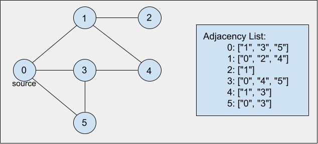

## Breadth First Search - BFS

### Definition

Traversing algorithm in which you start traversing from a selected node (source or starting node), which can be any of the vertices in the graph, followed by its adjacent nodes, then all nodes that can be reached by a path from the start node containing two edges, three edges, and so on, moving towards the next-level neighbour nodes.

Formally, BFS visits all vertices in a graph `G`, that are `k` edges away from the source vertex `s` before visiting any vertex `k+1` edges away. This is done until no more vertices are reachable from `s`.

This algorithm is analogous to the Level-order Traversal algorithm used for traversing trees.

### Step by step

Let's consider the graph shown in the image below. Also, select vertex `0` as the source node from which the traversal will begin. In order to keep track of the traversal process we will use a queue data structure.

- Enqueue the source vertex `0` and mark it as visited:

```javascript
queue = [0];
```

- Dequeue `0` and enqueue its neighbouring unvisited vertices, marking them as visited:

```javascript
queue = [1, 3, 5];
```

- Proceed to the next level by dequeuing `1` and enqueuing its neighbouring unvisited vertices, marking them as visited:

```javascript
queue = [3, 5, 2, 4];
```

- On the same level, we proceed by dequeuing `3` and enqueuing its neighbouring unvisited vertices, which are none:

```javascript
queue = [5, 2, 4];
```

- On the same level, we proceed by dequeuing `5` and enqueuing its neighbouring unvisited vertices, which are none:

```javascript
queue = [2, 4];
```

- Proceed to the next level by dequeuing `2` and enqueuing its neighbouring unvisited vertices, which are none:

```javascript
queue = [4];
```

- Next, we dequeue `4`, and since all the nodes have been visited, we are done.



### Pseudocode

This algorithm can be implemented in many different ways, see below the pseudocode for a simple exemplification:

```
bfs(Graph):
    while all vertices were not visited:
        enqueue vertex
            while queue is not empty:
                currentVertex = dequeue
                if it is the 1st time we come across currentVertex:
                    print currentVertex
                    set currentVertex as 'seen'
                    enqueue all adjacent nodes of currentVertex
                end if
            end while
    end while
end bfs
```

### Time Complexity

- O(V+E)

### Space Complexity

- O(V+E)

### References

- [Hackerearth](https://www.hackerearth.com/practice/algorithms/graphs/breadth-first-search/tutorial/)
- [Khan Academy](https://www.khanacademy.org/computing/computer-science/algorithms/breadth-first-search/a/the-breadth-first-search-algorithm)

### [Index](../../../README.md)
