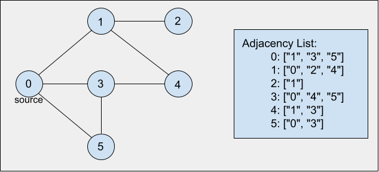

## Depth First Search

### Definition

This algorithm goes down a single path until the path leads to the vertex we are looking for or we reach the end of the path. If the end of the path is reached, the path was completely explored and we'll need to backtrack. In other words, if there are no more nodes along the current path, it is necessary to move backwards on the same path in order to find the next path to traverse. This process continues until we have discovered all the vertices that are reachable from the original source vertex. If any undiscovered vertices remain, then DFS selects one of them as a new source, and it repeats the search from that source.

If we recall from BFS, all paths from the starting location are explored at the same time, level by level, completely covering the area close to the starting vertex, moving farther away only when every vertex at the same distance from the source has been visited. Depth-first search explores the graph by traversing each individual path completely, going further and further from the starting vertex, traversing closer vertices and looking at other available paths only when the end of the paths are reached.

This algorithm is analogous to the Pre-order Traversal algorithm used for traversing trees.

## Step by step

Let's consider the graph shown in the image below. Also, select vertex `0` as the source node from which the traversal will begin. In order to keep track of the traversal process we will use a stack data structure. The basic idea is as follows:

1. Pick a starting node and push all its adjacent nodes into a stack.
2. Pop a node from the stack to select the next node to visit and push all its adjacent nodes into a stack.
3. Repeat this process until the stack is empty.
4. Ensure that the nodes that are visited are marked. This will prevent you from visiting the same node more than once.

- Push the source vertex `0` into the stack:

```javascript
stack = [0];
```

- Pop `0` from the stack, mark it as visited and push its adjacent unvisited vertices:

```javascript
stack = [1, 3, 5];
```

- Proceed to the next node by popping `5` from the stack, marking it as visited and pushing its adjacent unvisited vertices:

```javascript
queue = [1, 3, 3];
```

- Next, we proceed by popping `3` from the stack, marking it as visited and pushing its adjacent unvisited vertices:

```javascript
queue = [1, 3, 4];
```

- Next, we proceed by popping `4` from the stack, marking it as visited and pushing its adjacent unvisited vertices:

```javascript
queue = [1, 3, 1];
```

- Next, we proceed by popping `1` from the stack, marking it as visited and pushing its adjacent unvisited vertices:

```javascript
queue = [1, 3, 2];
```

- Finally, we pop `2`, and since all the other nodes in the stack have been already visited, we just pop them, emptying the stack, and we are done.



### Pseudocode

This algorithm can be implemented in many different ways, see below the pseudocode for a simple exemplification:

```
dfs(Graph):
    while all vertices were not visited:
        push source vertex into the stack
            while stack is not empty:
                currentVertex = pop element from the stack
                if it is the 1st time we come across currentVertex:
                    print currentVertex
                    set currentVertex as 'seen'
                    push all adjacent nodes of currentVertex into the stack
                end if
            end while
    end while
end dfs
```

### Time Complexity

- O(V+E)

### Space Complexity

- O(V+E)

### References

- [Hackerearth](https://www.hackerearth.com/practice/algorithms/graphs/depth-first-search/tutorial/)
- [Brilliant](https://brilliant.org/wiki/graphs/)

### [Index](../../../README.md)
