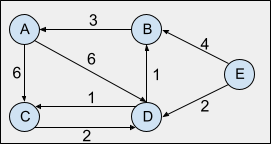
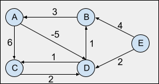

## Bellman-Ford

See the code by clicking [here](/Algorithms/Shortest%20Path/Bellman%20Ford/bellman-ford.js).

This algorithm, as the Dijkstra's, can be used to solve the Single Source Shortest Path problem (SSSP). The main difference between the two being that the Bellman-Ford algorithm is able to detect the existence of negative cycles in the graph. A negative cycle may be defined as a cycle whose edges sum to a negative value. If a graph has a negative cycle that is **reachable from the source**, then there is no cheapest path, any path that has a node in the negative cycle can be made cheaper by additional walks around the negative cycle. In such a case, the Bellman-Ford algorithm is able to identify the negative cycle and report its existence to the user.

### Definition

Initially, let's consider a graph which contains no negative cycles. We begin by creating an array of distances `distance[0, ..., n-1]` which will store the shortest distances from the source vertex to all other vertices if these vertices are reachable. Next we initialize this array to positive Infinite since none of the vertices were visited yet and they may as well be unreachable:

> `distance[0, ..., n-1] = Infinite`

We then consider that the distance from the starting node to itself is zero:

> `distance[0] = 0`

The algorithm will run for several iterations and at each iteration it will scan all the edges `(v,u)` with weight `w` in the graph and try to perform relaxations on them. This relaxation is an attempt to improve the value of `distance[u]` using the distance of the current vertex `distance[v]` and the cost to go from `v` to `u`, `w`. The relaxation process can be defined by the following expression:

> `distance[u] = min(distance[u], distance[v] + w)`

The Bellman-Ford algorithm assures that if the vertices are reachable from the source vertex and there are no negative cycles reachable from it, `V-1` iterations will be needed at most for the algorithm to provide the lengths of all shortest paths in the graph, where `V` is the total number of vertices on the graph. In case there are unreachable vertices from the starting vertex, their distances will remain `Infinite`.

In case the graph has a negative cycle reachable from the source vertex, it is safe to consider that the algorithm would run endlessly since at each iteration it would be able to optimize the shortest distances of the vertices affected by the cycle by performing additional relaxations. Therefore, we now have the criteria which, once met, indicates the presence of a negative cycle:

> If, after `(V-1)` iterations, we run the algorithm again and at least one more relaxation is performed, then the graph contains a negative cycle reachable from the source.

### Example - No negative cycle:

- Graph:

The graph below is a weighted, directed and cyclic graph.



Consider vertex `E` as being the starting vertex for the search, so `distance[E]=0`, the remaining vertices have their distance value set as `Infinite` initially. The algorithm will then check all of its edges and try to relax them in order to improve the value of the shortest path. This search does not have to be in any specific order. Let's walkthrough the first iteration of the Bellman-Ford algorithm:

**:: 1st iteration ::**

edge `A -> C`:

> `distance[C] = min(distance[C], distance[A] + weight(A,C))`
>
> `distance[C] = min(Infinite, Infinite + 6)` -- No update is perfomed.

edge `A -> D`:

> `distance[D] = min(distance[D], distance[A] + weight(A,D))`
>
> `distance[D] = min(Infinite, Infinite + 6)` -- No update is perfomed.

edge `B -> A`:

> `distance[A] = min(distance[A], distance[B] + weight(B,A))`
>
> `distance[A] = min(Infinite, Infinite + 6)` -- No update is perfomed.

edge `C -> D`:

> `distance[D] = min(distance[D], distance[C] + weight(C,D))`
>
> `distance[D] = min(Infinite, Infinite + 2)` -- No update is perfomed.

edge `D -> B`:

> `distance[B] = min(distance[B], distance[D] + weight(D,B))`
>
> `distance[B] = min(Infinite, Infinite + 1)` -- No update is perfomed.

edge `D -> C`:

> `distance[C] = min(distance[C], distance[D] + weight(D,C))`
>
> `distance[C] = min(Infinite, Infinite + 1)` -- No update is perfomed.

edge `E -> B`:

> `distance[B] = min(distance[B], distance[E] + weight(E,B))`
>
> `distance[B] = min(Infinite, 0 + 4) = 4`

edge `E -> D`:

> `distance[D] = min(distance[D], distance[E] + weight(E,D))`
>
> `distance[D] = min(Infinite, 0 + 2) = 2`

As previously stated, the algorithm is supposed to finish the search in at most `V-1` iterations, where `V` is the total number of vertices, which in this case is `5`, so in at most `4` iterations the algorithm should be done. This can be verified in the Distance Matrix below which follows the algorithm through all its iterations and we can notice that after the third iteration no more relaxations were performed which satisfies the criteria.

- Distance Matrix:

| Initialization | 1st iter. | 2nd iter. | 3rd iter. | 4th iter. |
| :-- | :-- | :-- | :-- | :-- |
| Node--Dist. | Dist.--Parent | Dist.--Parent | Dist.--Parent | Dist.--Parent |
| A -- Inf | Inf -- unknown | 4+3=7 -- B | 3+3=6 -- B | 6 -- B |
| B -- Inf | 4 -- E | 2+1=3 -- D | 3 -- D | 3 -- D |
| C -- Inf | Inf -- unknown | 2+1=3 -- D | 3 -- D | 3 -- D |
| D -- Inf | 2 -- E | 2 -- E | 2 -- E | 2 -- E |
| E -- 0 | 0 -- none | 0 -- none | 0 -- none | 0 -- none |

- Final Answer:

| Vertex | Distance from source |     Path      |
| :----: | :------------------: | :-----------: |
|   A    |          6           | E > D > B > A |
|   B    |          3           |   E > D > B   |
|   C    |          3           |   E > D > C   |
|   D    |          2           |     E > D     |
|   E    |          0           |       -       |

### Example - With negative cycle:

- Graph:

The graph below is an updated version of the one in the previous example in which we've updated the weight of the edge `A->D` from `6` to `-5` causing the negative cycle `D->B->A->D`.



If we walk through the algorithm as we've done previously following the Distance Matrix below, we'll notice that `distance[]` will continue to be updated endlessly after the `V-1` iteration, so the algorithm runs indefinitely updating the shortest paths towards `-Infinite`.

- Distance Matrix:

| Initialization | 1st iter. | 2nd iter. | 3rd iter. | 4th iter. | 5th iter. |
| :-- | :-- | :-- | :-- | :-- | :-- |
| Node--Dist. | Dist.--Parent | Dist.--Parent | Dist.--Parent | Dist.--Parent | Dist.--Parent |
| A -- Inf | Inf -- unknown | 4+3=7 -- B | 3+3=6 -- B | 6 -- B | 2+3=5 -- B |
| B -- Inf | 4 -- E | 2+1=3 -- D | 3 -- D | 1+1=2 -- D | 2 |
| C -- Inf | Inf -- unknown | 2+1=3 -- D | 3 -- D | 1+1=2 -- D | 2 |
| D -- Inf | 2 -- E | 2 -- E | 2 -- E | 6-5=1 -- A | 1 |
| E -- src | 0 -- none | 0 -- none | 0 -- none | 0 -- none | 0 |

### Pseudocode

- Calculating the shortest paths:

```
bellman-ford(graph):
    V is the number of vertices in the graph
    set every entry in distance[] to Infinity
    set distance[source] to 0

    for i=0 to V-1:
        for each edge (v,u):
            // relaxation:
            if distance[u] > (distance[v] + weight(v,u)):
                distance[u] = distance[v] + weight(v,u)
            end if
        end for
    end for
    ...
```

- Detecting negative cycles:

```
    ...
    for each edge (v,u):
        // relaxation:
        if distance[u] > (distance[v] + weight(v,u)):
            //relaxation is still possible
            warns user of the presence of a negative cycle
        end if
    end for

```

### Time complexity

- O(V\*E), where `V` is the number of vertices and `E` the number of edges.

### Space complexity

- O(V), where `V` is the number of vertices.

### References

- [YouTube - William Fiset](https://www.youtube.com/watch?v=lyw4FaxrwHg&list=PLDV1Zeh2NRsDGO4--qE8yH72HFL1Km93P&index=20)
- [YouTube - Jenny's Lectures](https://www.youtube.com/watch?v=KudAWAMiQog&list=PLdo5W4Nhv31bbKJzrsKfMpo_grxuLl8LU&index=93)
- [YouTube - Abdul Bari](https://www.youtube.com/watch?v=FtN3BYH2Zes&list=PLDN4rrl48XKpZkf03iYFl-O29szjTrs_O&index=54)
- [CP - Algorithms](https://cp-algorithms.com/graph/bellman_ford.html)
- [Programiz](https://www.programiz.com/dsa/bellman-ford-algorithm)

### [Data Structures & Algorithm - Index](../../../README.md)
