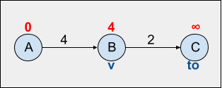

## Dijkstra

See the code by clicking [here](/Algorithms/Shortest%20Path/Dijkstra/dijkstra.js).

Consider a graph `G` with `n` vertices, `m` edges and non-negative weights. Next, you're given a source vertex `s` and asked to find the lengths of the shortest paths from `s` to other vertices on the graph `G`, returning also the shortest paths themselves. This problem is called **single-source shortest path** problem and one of the solutions for this problem is given by the Dijkstra algorithm.

### Definition

In the Dijkstra algorithm, we consider an array `distance[]` where for each vertex `v` we store the current length of the shortest path from starting vertex `s` to `v`, `distance[v]`. Naturally, as vertex `s` is the source vertex, `distance[s] = 0`, and for other vertices `distance[v] = Infinite`, initially. In addition, we keep a boolean data structure, which can an array our a map, `visited[]` which stores whether each vertex `v` has been visited or not. Initially all vertices are unvisited, so `visited[v] = false`. The algorithm will run for `n` iterations and at each iteration an unvisited vertex `v` with the smaller value of `distance[v]`, i.e. the vertex `v` closest to the node being currently visited, is selected.

The selected vertex `v` is then marked as visited, and the algorithm considers all edges of the form `(v,to)`, i.e. all edges outgoing from `v` to a neighbour/adjacent vertex, and for each vertex `to`, the algorithm tries to improve the value of `distance[to]`.

- Example

Consider the following graph where the algorithm is currently at vertex `B`, so `v = B`. It then considers vertex `C`, i.e. `(v,to)=>(B,C)`, as `C` is unvisited, the current length of the shortest path leading from `B` to `C` is `Infinite`, `distance[C] = Infinite`. The algorithm then sees that this length can be improved since there is a path/edge going from `B` to `C` with weight `2`, `weight(v,to) => weight(B,C) = 2`, then `distance[C] = Infinite => distance[C] = 2`.



This approach of looking for the shortest path from one vertex to another and updating `d[to]` as it goes through the graph is called _relaxation_ and can be described by the following expression:

```javascript
if (distance[v] + weight(v, to) < distance[to])
  distance[to] = distance[v] + weight(v, to);
```

or

```javascript
distance[to] = min(distance[to], distance[to] + weight(v, to));
```

After all of vertex `v` neighbours are considered, the algorithm keeps exploring `s` adjacent vertices searching for better paths. After `n` iterations, all vertices are marked as visited and the algorithm terminates. By examining the array `distance[v]` we can see all the shortest paths leading from the starting vertex `s` to all other vertices `v`. Notice that if there is any vertex which is unreachable from `s`, its value of `distance[v]` will remain as `Infinite` since there are no paths to consider.

### Algorithm

- Pseudocode

```
dijkstra(graph, source, destination):
  n is the number of nodes in the graph
  visited = [false, ..., false] //size n
  distance = [Infinite, ..., Infinite] //size n

  distance[source] = 0

  queue: an empty priority queue

  insert [source, distance[source]] to the queue

  while the queue is not empty:
      [currentVertex, weight] = top element in the queue
      visited[currentVertex] = true

      for( currentVertex adjacent vertices ):
          [vertexTo, weightTo] = vertex
          if the vertexTo was not yet visited:
              //relaxation:
              if distance[currentVertex] + weightTo < distance[vertexTo]:
                  //update distance:
                  distance[vertexTo] = distance[currentVertex] + weightTo
                  //set predecessor:
                  predecessor[vertexTo] = currentVertex

                  insert [vertexTo, distance[vertexTo]] to the queue
              end if
          end if
      end for
  end while
end dijksta
```

### Time complexity

- O(V^2), where V is the number of vertices.

### Space complexity

- O(V), where V is the number of vertices.

### References

- [YouTube - William Fiset](https://www.youtube.com/watch?v=pSqmAO-m7Lk&list=PLDV1Zeh2NRsDGO4--qE8yH72HFL1Km93P&index=18)
- [YouTube - Jenny's Lectures](https://www.youtube.com/watch?v=smHnz2RHJBY&list=PLdo5W4Nhv31bbKJzrsKfMpo_grxuLl8LU&index=94)
- [YouTube - Abdul Bari](https://www.youtube.com/watch?v=XB4MIexjvY0&list=PLDN4rrl48XKpZkf03iYFl-O29szjTrs_O&index=47)
- [CP - Algorithms](https://cp-algorithms.com/graph/dijkstra.html)

### [Data Structures & Algorithms - Index](../../../README.md)
