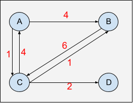

## Floyd-Warshall

See the code by clicking [here](/Algorithms/Shortest%20Path/Floyd-Warshall/floyd-warshall.js).

### Definition

The Floyd-Warshall is an All-Pairs Shortest Path (APSP) algorithm. This means that it can find the shortest path between all pairs of nodes, as long as they are reachable. This algorithm has a time complexity of **`O(V^3)`**, so it is better suited for small graphs.

For the Floyd-Warshall algorithm, the optimal way to represent a graph is by using an adjacency matrix. Consider an adjacency matrix `M`, the element at `M[i][j]` represent the edge's weight of going from vertex `i` to vertex `j`. For example, consider the graph below:

- Graph:



It is assumed that the distance from a vertex to itself is zero. Therefore, the diagonal has only zeros. Additionally, if there is no edge connecting vertix `i` to vertex `j`, the edge weigth at is set to positive **Inf**inity. See below the Adjacency Matrix which represents the graph shown above:

- Adjacency Matrix:

|     |   A   |   B   |   C   |   D   |
| :-: | :---: | :---: | :---: | :---: |
|  A  |  `0`  |  `4`  |  `1`  | `Inf` |
|  B  | `Inf` |  `0`  |  `6`  | `Inf` |
|  C  |  `4`  |  `1`  |  `0`  |  `2`  |
|  D  | `Inf` | `Inf` | `Inf` |  `0`  |

The way this algorithm works is that it compares all possible paths through the graph between each pair of vertices, testing every combination of edges. This process is performed by incrementally improving an estimate on the shortest path between the two vertices, until the estimate is optimal.

Let's say we wanted to find the path from vertex `A` to vertex `B`. By taking a look at the adjancency matrix for the graph given above we can see that there is an edge connecting `A` directly to `B` and its weight is `4`, so considering the matrix rows (`i`) as the starting points and the columns (`j`) as the destinations, the cost for going from `A` to `B` can be expressed by the following:

> distance from A to B:
>
> `distance[A][B]` => `distance[i][j] = distance[0][1] = 4`

Next, during the iteration process, the algorithm will test if there are any other intermediary vertices/paths that we can take to get from `A` to `B` at a lower cost. In this case, we also have an edge which connects `A` to `C` and weights `1`, so:

> distance from A to C:
>
> `distance[A][C]` => `distance[i][j] = distance[0][2] = 1`

Further down the iteration road, the algorithm sees that there is an edge connecting `C` to `B` and its weight is `1`:

> distance from C to B:
>
> `distance[C][B]` => `distance[i][j] = distance[2][1] = 1`

So now that the algorithm knows that we can get from `A` to `B` via `C`, it then compares the cost of both paths and updates the value of `distance[A][C]` with the lowest one:

> `(distance[A][B] = 4)` is greater than `(distance[A][C] + distance[C][B] = 2)`

so

> `distance[A][B] = distance[A][C] + distance[C][B] = 1+1 = 2`

This analisys is performed for every pair of vertices and if we write a pseudocode for this check in terms of the adjacency matrix indices we have

```
if distance[i][j] > distance[i][k] + distance[k][j]:
      distance[i][j] = distance[i][k] + distance[k][j]
```

The behavior of the Floyd-Warshall algorithm can then be summarized by the following expression:

> `distance[i][j] = min(distance[i][j], distance[i][k] + distance[k][j])`

where `k` can represent either a single vertex or a path that connects vertex `i` to vertex `j`.

### Pseudocode

See below a basic pseudocode for the Floyd-Warshall algorithm:

```
Floyd-Warshall(G):
    n: number of vertices on the graph
    distance: nxn matrix to store the shortest paths, initialize it with 0s

    copy G to D

    for k=0 to k=n-1:
        for i=0 to i=n-1:
            for j=0 to j=n-1:
                if distance[i][j] > distance[i][k] + distance[k][j]:
                    distance[i][j] = distance[i][k] + distance[k][j]
                end if
            end for
        end for
    end for

    return distance matrix
```

### Negative Cycles

In order to go through a cycle, it is necessary to pass by the same node at least twice, so in order to go through a negative cycle the algorithm would need to go 'via' a 'negative cycle participating vertex' at least twice, which does not happen throughout the execution of this algorithm since it never loops more than once 'via' the same vertex. However, even though it is not possible to find the shortest paths for the affected nodes in case a negative cycle exists, it is still possible to detect its existence by running the algorithm one more time, similar to what is done for the Bellman-Ford algorithm. If any of the shortest path value gets updated, it means that there is a negative cycle in the graph. See a simple pseudocode for this check below:

```
  negativeCycleExists: boolean initialized with false

  for k=0 to k=n-1:
      for i=0 to i=n-1:
          for j=0 to j=n-1:
              if distance[i][j] > distance[i][k] + distance[k][j]:
                  negativeCycleExists = true
                  //here we can either break out of the iteration if
                  //detecting the negative cycle is enough or we can
                  //keep going and flagging all vertices which are affected
              end if
          end for
      end for
  end for
```

### Time complexity

- O(V^3), where `V` is the number of vertices.

### Space complexity

- O(V^2), due to the distance matrix which is `VxV`.

### References

- [YouTube - William Fiset](https://www.youtube.com/watch?v=4NQ3HnhyNfQ&list=PLDV1Zeh2NRsDGO4--qE8yH72HFL1Km93P&index=21)
- [YouTube - Jenny's Lectures](https://www.youtube.com/watch?v=Gc4mWrmJBsw&list=PLdo5W4Nhv31bbKJzrsKfMpo_grxuLl8LU&index=95)
- [YouTube - Abdul Bari](https://www.youtube.com/watch?v=oNI0rf2P9gE&list=PLDN4rrl48XKpZkf03iYFl-O29szjTrs_O&index=50)
- [CP - Algorithms](https://cp-algorithms.com/graph/all-pair-shortest-path-floyd-warshall.html)

### [Data Structures & Algorithm - Index](../../../README.md)
