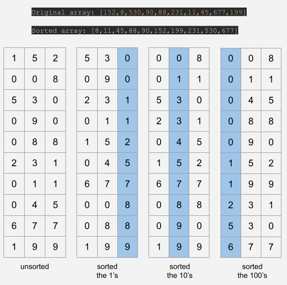

## Radix Sort

### Definition

Radix-sort is a stable non-comparative sorting algorithm which sorts the data by distributing elements into groups according to their radix (place value, base). For elements with more than one significant digit, this distribution process is repeated for each digit, while preserving the ordering of the prior step, until all digits have been considered. Radix sorts is usually implemented by starting from the least significant digit (LSD) for numbers and from the most significant digit (MSD) for words.

Here, Counting Sort is used as a subroutine to sort an array of numbers corresponding to the place values, i.e., if the data is an array of integers, each individual digit can go from 0 to 9 (10 digits - base 10). Since it is not comparison based, radix sort is not bounded by _O(nlog⁡n)_ for running time and it can perform in linear time.

As it sorts by place value and not the whole number at once, it can sort larger numbers without decreasing the efficiency due to the size of the range of keys the algorithm goes over. To provide a perspective, consider the array below:

> `specialArray = [152, 8, 530, 90, 88, 231, 11, 45, 677, 199]`

If we were to sort this array using counting sort directly, we'd have a `count` array with a size equal to the maximum number in `specialArray` where for each element of `specialArray` we'd store how many times it appears in `count` at the position `count[specialArray[i]]`. We can easily see that being very inefficient for the example above since `count` would have to have 678 (0 to 677) elements and `specialArray` only has 10 elements to be sorted which would mean that we'd have most of the positions in `count` would be empty (huge waste of time). What Radix Sort does is that it uses Counting Sort to sort each individual digit and since at each iteration each digit can only go from 0 to 9, with 9 being the maximum number, the size of `count` is pretty much set to at most 10.

### Steps

Let's go through the important pieces of the [code](radixSort.js) real quick.

1. We first get the maximum value in the array, 677 in this case. This value says how many times the `countingSort(array,position)` algorithm will be called, which will be 3 since we have three place values to sort, the 1's (1st 7), the 10's (2nd 7) and the 100's (6).

```javascript
let max = getMax(array);
```

2. Next we have a `for` loop which iterates through the place values. Here we have a variable called `position` which uses the previously calculated max value to determine which position in the digit is being sorted. The first iteration goes through the `1`'s, the second through the `10`'s and so on. After that, `(max/position) = (677/1000) < 1` and the execution gets out of the `for` loop.

```javascript
for (let position = 1; max / position > 1; position = position * 10) {
  countingSort(array, position);
}
```

3. When inside the for loop, countingSort gets called. This is the standard counting sort algorithm that you can find [here](../Counting%20Sort/countingSort.js), the only difference being the fact that we are now passing the variable `position` since we need to know which position is getting sorted.
   - Speedrunning through the counting sort logic, we first iterate through all the elements in `specialArray` (remember we are considering one digit at a time, so each digit is inside the 0 to 9 range) and store how many times each digit happens in the array `count`, so, for example, in the first iteration we have two 0's (9**0** and 53**0**) and two 1's (23**1** and 1**1**) so `count[0]=2` and `count[1]=2` and yada yada.
   - The tricky part to grasp here may be the calculation `Math.floor((array[i]/position)%10)` which is just a way to select the right digit by using `position`. For example, suppose it is the second iteration, so we are going through the second digits and we need to get the **3** in 5**3**0, `(specialArray[2]/position)%10 = (530/10)%10 = 53%10 = 3`. The `Math.floor` is there for when we get to the most significant digit and the `%` operation returns a number with a fractional part, i.e., 5.3, we floor it and get the goodies.

```javascript
for (let i = 0; i < array.length; ++i) {
  ++count[Math.floor((array[i] / position) % 10)];
}
```

4. Next, `count` gets modified so that each `count[i]` includes the number of elements less than it. This can be accomplished by going through `count` and replacing each `count[i]` value with `count[i]+count[i−1]`. This step allows counting sort to determine from which index to which index element `i` is present at that position which ends up determining at what index in the sorted array `sortedArr` an element should be placed. For the example mentioned previously, before any modification `count` begins like `count = [2, 2, ...]`, after modifying it, we'll have `count = [2, 4, ...]` which just means that we have two numbers which their last digit is 0 in the first two positions of `count` (530 and 90), then we have two more numbers which their last digit is 1 in the third and fourth positions (231 and 11) and so on.

```javascript
for (let i = 1; i <= key; ++i) {
  count[i] = count[i] + count[i - 1];
}
```

5. Lastly, now it is just a matter of mapping the elements in the original array to the sorted one using `count`. Since we want to keep the stability of the sorting, we iterate through `specialArray` from the last element to the first. For example, for 199 `count[Math.floor((array[9]/position)%10)]-1` gives the position where it goes in the sorted array, see, `count[Math.floor((199/100)%10)]-1 --> count[1]-1` where `count = [5,7,8,8,8,9,10,10,10,10]`, so we have `count[1]-1 = 7-1 = 6`, so `sortedArr[6]=199`.

```javascript
for (let i = array.length - 1; i >= 0; i--) {
  sortedArr[count[Math.floor((array[i] / position) % 10)] - 1] = array[i];
  --count[Math.floor((array[i] / position) % 10)];
}
```

So much for "speedrunning", huh?

Check the image below to see how the array changes as the sorting goes through each digit.



### Time Complexity

- Worst case - _O(k\*n)_

### Space Complexity

- Worst case - _O(k+n)_

### Resources & References

- #### [Brilliant](https://brilliant.org/wiki/radix-sort/)
- #### [Wikipedia](https://en.wikipedia.org/wiki/Radix_sort)
- #### [Youtube](https://www.youtube.com/watch?v=Il45xNUHGp0&list=PLdo5W4Nhv31bbKJzrsKfMpo_grxuLl8LU&index=107)
- #### [GeeksforGeeks](https://www.geeksforgeeks.org/radix-sort/)

### [Index](../../../README.md)
