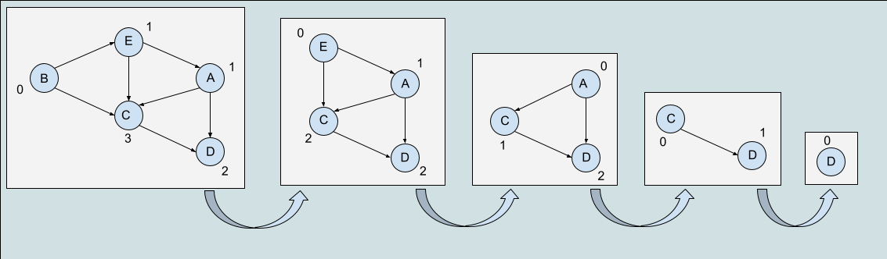

## Topological Sort

### Definition

A topological sort is an ordering of the nodes in a directed graph where for each directed edge from `node A` to `node B`, `node A` appears before `node B` in the ordering. The topological sort algorithm is able to find a topological order in O(V+E) time. Also, there may be multiple possible solutions.

It is important to mention that in order to be able to perform a topological sort in a graph, the graph must be a Directed Acyclic Graph (DAG), since, having cycles would create an impossible set of constraints.

### Algorithm

The first vertex in topological sorting is always a vertex with in-degree of `0`, which just means that the vertex has no incoming edges. This vertex is then added to the ordering and "removed" from the graph. As the vertex is removed, the adjacent nodes' in-degree gets updated since that by removing a node we also remove its outgoing edges. The process is then repeated for the other vertices. Listing the steps ...

1. Select node with in-degree of zero
2. Add this node to the ordering
3. "Remove" node and its outgoing edges from the graph
4. Repeat untill we go through all the nodes

The order in which the nodes are removed is then one of the possible solutions.

- Pseudocode

Translating the steps above to a pseudocode we get the algorithm below:

```
topologicalSort(Graph):
    for each of the nodes:
        if the node is unvisited:
            topologicalVisit(node)
        end if
        pop stack
    end for
end func

topologicalVisit(Node):
    for each of the node's neighbours:
        if the neighbours is unvisited:
            topologicalVisit(Node)
        end if
    end for
    mark node as visited and push it to the stack
end func
```

- Example

To better understand, let's go through the example below:



By looking at the initial graph we can see that vertex `B` has an in-degree of `0`, which, as previously stated, simply means that this vertex has no incoming edges and there is no other vertex that should come before it. As it is the first time we come across this vertex, we then check its adjacent nodes and for each one of them, if not yet visited, recursively checks its neighbouring vertices. As you may have noticed we mention the word "remove" between double- quotes, that's because we don't actually remove the vertex from the graph as this would completely mess up the input, instead this removal is seen as marking the vertex as `visited`.

1. Vertex `B` has in-degree of 0 and is unvisited. Call `topologicalVisit` on node `B` and check its adjacent nodes `["E", "C"]`. For each of the adjacent nodes, check if they were already visited, if not, recursively call `topologicalVisit` on them.
2. Vertex `E` is unvisited, call `topologicalVisit` on vertex `E` and and check its adjacent nodes `["A", "C"]`.
3. Vertex `A` is unvisited, call `topologicalVisit` on vertex `A` and and check its adjacent nodes `["C", "D"]`.
4. Vertex `C` is unvisited, call `topologicalVisit` on vertex `C` and and check its adjacent nodes `["D"]`.
5. Vertex `D` doesn't not have any adjacent nodes (neighbours), so we mark it as visited and push it to the stack:

   > `stack: ["D"]`

6. This ends the recursive call for `D` and we get back to `C`, which doesn't have anymore neighbours so we mark it as visited and push it to the stack:

   > `stack: ["D", "C"]`

7. This ends the recursive call for `C` and we get back to vertex `A`, whose only other neighbour is `D`. As `D` was already visited, we mark vertex `A` as visited and push it to the stack:

   > `stack: ["D", "C", "A"]`

8. This ends the recursive call for `A` and we get back to vertex `E`, whose only other neighbour is `C`. As `C` was already visited, we mark vertex `E` as visited and push it to the stack:

   > `stack: ["D", "C", "A", "E"]`

9. This ends the recursive call for `E` and we get back to vertex `B`, whose only other neighbour is `C`. As `C` was already visited, we mark vertex `B` as visited and push it to the stack:

   > `stack: ["D", "C", "A", "E", "B"]`

10. We then get back to the driver function `topologicalSort()` and finish running the `for` loop, popping all the elements from the stack. The order in which they are popped is the topological order.
    > `topological sort: "B" -> "E" -> "A" -> "C" -> "D"`

### Time complexity

- O(V+E)

### Space complexity

- O(E)

### References

- [YouTube - William Fiset](https://www.youtube.com/watch?v=eL-KzMXSXXI&list=PLDV1Zeh2NRsDGO4--qE8yH72HFL1Km93P&index=15)
- [YouTube - Jenny's Lectures](https://www.youtube.com/watch?v=dis_c84ejhQ&list=PLdo5W4Nhv31bbKJzrsKfMpo_grxuLl8LU&index=89)
- [CP - Algorithms](https://cp-algorithms.com/graph/topological-sort.html)

- [Interview Cake](https://www.interviewcake.com/concept/java/topological-sort)

### [Get back to the Table of Contents](../../../README.md)
