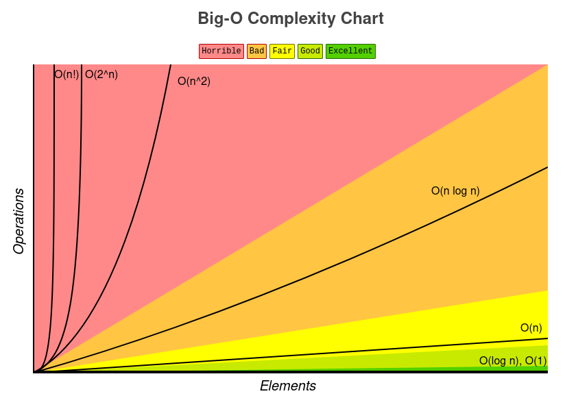

## Big-O: Time and Space Complexity Analisys

### Definition

The Big-O notation provides us the information of how fast a given algorithm is. It allows us to compare the number of operations and informs us of how quickly the algorithm grows. This particular way of measuring the running time of an algorithm takes into account the worst case, i.e. in the worst possible scenario we can be sure that an algorithm performance won't be worse than its Big-O notation. The speed of an algorithm is not measured in seconds, but based on the growth of the number of operations, in other words, it is based on how quickly the running time increases as the input size grows. Big-O allows us to express how the runtime scales.

### Common Big-O notations

The chart below ilustrates how the most common Big-O running times behave as the size of the input grows (source: [Big-O Cheatsheet by Eric Rowell](https://www.bigocheatsheet.com/)).



Common time complexities ordered from best to worst:

1. Constant - `O(1)`:

A **constant** running time means that no matter the size of the input, the performance of the algorithm will be the same. Since this algorithm running time does not depend on the size of the input, the number of operations remains constant and does not increase as the input size grows.

It is good to mention, however, that a constant running time does not mean that something happens instantaneously, but that the running time will always be the same no matter how large is the dataset.

> Example: In the function `getMax` below, no matter the values of `a` and `b`, `getMax` always performs the same amount of operations.

```javascript
function getMax(a, b) {
  if (a > b) {
    return a;
  }
  return b;
}
```

1. Logarithmic - `O(log n)`:

2. Linear - `O(n)`:

3. Linearithmic - `O(n * log n)`:

4. Quadratic - `O(n^2)`:

5. Exponential - `O(b^n)`, where b > 1:

6. Factorial - `O(n!)`:

### Determining the Big-O notation

#### General rules

1. Different steps get added

   - Example:

2. Drop the constants

   - Example:

3. Different inputs equate to different variables

   - Example:

4. Drop the non-dominant terms
   - Example:

#### Steps:

1. Identify your code
2. Identify what `n` means (Rule #3)
3. Count the steps in a typical run (Rule #1)
4. Keep the most significant part (Rules #2 and #4)

### Time Complexity

### Space Complexity

### Additional Examples

### A few takeaways

### References

- [Grokking Algorithms: An Illustrated Guide for Programmers and Other Curious People](https://www.manning.com/books/grokking-algorithms)
- [Cracking the Coding Interview](https://www.crackingthecodinginterview.com/)

### [Data Structures & Algorithms - Index](../README.md)
