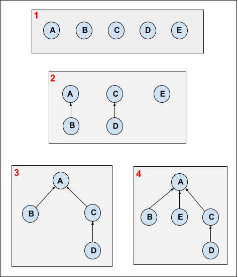

## Disjoint Set Union

See code for this data structure [here](/DataStructures/Disjoint%20Set/dsu.js).

### Definition

Also called Union Find due to the name of its two main operations, this data structure keeps track of a "set of elements" which are partitioned into a number of disjoint and non-overlapping sets. Each set has a representative which helps identifying that set. This data structure is used in Kruskal's algorithm to detect cycles in undirected graphs.

Consider that we are given several elements, each of which is a separate set, a Disjoint Set Union (DSU) provides the functionality to combine any two sets, to identify in which set a specific element is and to create a new set from a new element.

### Basic interfaces/Standard operations:

- `make_set(A)`: creates a new set consisting of the new element `A`.
- `find_set(A)`: returns the set representative's name in which the element `A` is located. This representative is an element of its corresponding set. It is selected in each set by the data structure itself and can change overtime, namely after `union_set(A,B)` calls. This representative can be used to check if two elements are part of the same set or not. If `find_set(A)` returns the same element as `find_set(B)`, i.e. both function calls return the same set representative, this means that both `A` and `B` belong to the same set.
- `union_set(A,B)`: merges sets `A` and `B` into a single set.

For simplicity, we can imagine the sets as trees, each tree corresponding to one set and the root of the tree is the representative of the set.

### Example

The image below illustrates how the DSU data structure is represented, and how each operation takes place:



1. Every element starts as a single set, each set being the root of its own tree.
2. Merge sets `A` and `B` and sets `C` and `D`.
3. Combine the sets containing elements `A` and `D`. Notice that, for element `D`, we first need to determine the representative of the set in which `D` is located, which is `C`, and then merge it to the other set by making `C` a child of `A`. Now we have a single set whose representative is `A`.
4. Merge sets containing elements `B` and `E`. Same process done for step `3`.

### Pseudocode

Below we are going to consider two approaches, a naive one and a better, optimized one which speeds up the main operations. The naive approach is inefficient because, since the merging process is always done in the same way, the data structure can become skewed and the tree will end up looking more like long chains. In the case that this happens, the operation `find_set(A)` will have a time complexity of O(N).

For simplicity, let's consider that all the information about the sets will be kept in an array, `parent[]`. To create a new set `A`, operation `make_set(A)`, a new tree is created with its root being the new set `A`, meaning that this vertex is its own parent/ancestor.

- `make_set(A)`:

a. Naive approach:

```
make_set(A):
  // create a new set consisting of the new element A:
  parent[A] = A
```

b. Optimized approach - we update the previous implementation to also keep track of the size of the set, which will be useful to optimize the union operation:

```
make_set(A):
  // create a new set consisting of the new element A:
  parent[A] = A

  // keep count of the set size:
  size[A] = 1
```

To combine two existing sets, operation `union_set(A,B)`, it is necessary to find the representatives for the sets where elements `A` and `B` are located and check if they belong to the same set. If so, nothing needs to be done. If not, merge the sets by making the representative for one of the sets the parent of the other.

- `union_set(A,B)`:

a. Naive approach:

```
union_set(A,B):
  // if A and B are in the same set return the set's representative:
  if parent[A] = parent[B]
    return parent

  // else, merge sets by merging set B into set A, or the other way around:
  parent[B] = A // or it could be parent[A] = B

  return merged set representative

```

b. Optimized approach - _union by size/rank_: instead of always merging the sets in the same way, i.e. set `A` to set `B`, which can lead to chains of length O(N), we now merge the set with lower rank to the set with higher rank, which also might makes us perform less "move" operations while merging the sets:

```
union_set(A,B):
  // if A and B are in the same set return the set's representative:
  if parent[A] = parent[B]
    return parent

  // else, check which set has a higher rank (either its size of the amount of
  // children it has) and then merge sets by merging the smaller rank set into
  // the larger one:
  if size[A] > size[B]
    parent[B] = A
  else
    parent[A] = B

  return merged set representative

```

For finding out the representative of the set in which element `A` is located, operation `find_set(A)`, simply "climb" the parent tree for `A` until we reach the root, i.e. node whose reference to its parent leads to itself.

- `find_set(A)`:

a. Naive approach:

```
find_set(A):
  // if A is the representative of the set:
  if A = parent[A]
    return A

  // else, go up the tree looking for its representative, i.e. the tree' root:
  return find_set(parent[A])
```

b. Optimized approach - _path compression_: when calling `find_set(A)` for some element `A`, we actually find the representative for all elements that are visited on the path between `A` and its actual representative `R`. In order to make the searching operation faster, we can make the path for all the visited nodes shorter, by attaching them directly to the representative `R`. The pseudocode below does exactly that, it first finds the representative of the set, and then, in the process of stack unwinding, attaches the visited nodes directly to the set's representative. This simple change helps to improve the time complexity to O(log N) per call on average.

```
find_set(A):
  // if A is the representative of the set:
  if A = parent[A]
    return A

  // else, go up the tree looking for its representative, i.e. the tree' root,
  // and attach the nodes that you pass through directly to the set's
  // representative:
  return parent[A] = find_set(parent[A])
```

This data structure is commonly used in the Kruskal algorithm to find the inimum Spanning Tree (MST) of a graph.

- [Kruskal's Algorithm](/Algorithms/Minimum%20Spanning%20Tree/Kruskal/README.md)
- [Minimum Spanning Tree](/DataStructures/Graphs/Minimum%20Spanning%20Tree/README.md)

### Time and Space complexities

|     Operation     | Time Complexity | Space Complexity |
| :---------------: | :-------------: | :--------------: |
|   `make_set(A)`   |      O(N)       |       O(N)       |
|   `find_set(A)`   |     O(N)\*      |       O(1)       |
| `union_set(A, B)` |     O(N)\*      |       O(1)       |
|                   |                 |                  |

\*Considering the naive approach.

### References

- [CP-Algorithms](https://cp-algorithms.com/data_structures/disjoint_set_union.html)

### [Data Structures & Algorithm - Index](../../../README.md)
