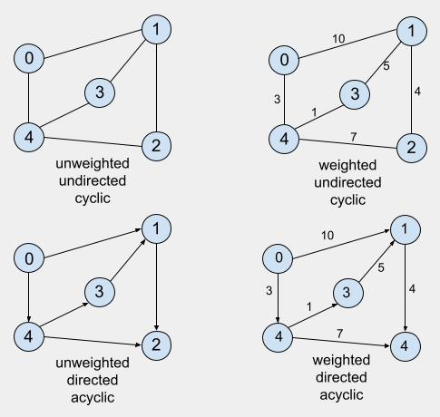
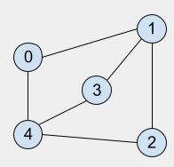

## Graphs

Check out the code for this data structure [here](/DataStructures/Graphs/src).

### Definition

Collections of nodes and edges, which serve to represent connections. These nodes, also called vertices, hold the data and are connected to other nodes through connections called edges.

In a more formal way, we can describe a graph `G` as an abstract data type consisting of a set `V` of vertices and a set `E` of edges such that each edge _`e`_ _∈_ `E` is associated with a pair of vertices _∈_ `V`. A graph `G` with vertices `V` and edges `E` may be written as `G=(V,E)`.

### Terminologies

- Adjacency: a vertex `x` is said to be adjacent to another vertex `y` if there is an edge connecting `x` and `y` them.

### Types of Graphs

- Weighted _vs_ Unweighted

Weighted graphs have values assigned to their edges, so to go from a vertex to another it is necessary to take these values into account. They can represent the cost or penalty for choosing an specific edge to go from one vertex to another. In unweighted graphs, the edges just represent connections or paths and don't have any value associated with them.

- Directed _vs_ Undirected

An undirected graph is one in which its edges have no orientations, i.e., edges `(x,y)` and `(y,x)` are equivalent. A directed graph, on the other hand, have a defined orientation and edges may behave like one-way roads where it is possible to use edge _`e1`_ to go from vertex `x` to vertex `y`, but this same edge does not allow us to make the way back. Therefore, an edge `(x,y)` is completely distinct from the edge `(y,x)`.

- Cyclic _vs_ Acyclic

A graph can be classified as cyclic if there is any path `{A1, …, An}` such that the edges `A1→A2`, `A2→A3`​, `…`, and `An→A1`​ all exist, thus forming a loop.

A few variations of graph types can be seen in the image below: 

### Graph Representation

Below is an illustration of a unweighted-undirected-cyclic graph:



- Adjacency List

It is a way of associating each vertex (or node) in the graph with its respective list of neighboring vertices, i.e, vertices which are connected by edges to it. An adjacency list represents a graph as an array of linked lists. The index of the array represents a vertex and each element in its linked list represents the other vertices that form an edge with the vertex. An adjacency list is efficient in terms of storage because it only needs to store the values for the edges. For a graph representing large amounts of data this can save a lot of space.

```c++
adjList = [
            0: 1→4,
            1: 0→3→2,
            2: 1→2,
            3: 1→4,
            4: 0→2→3
          ]
```

- Adjacency Matrix

An adjacency matrix is a 2D array of `V x V` vertices. Each row and column represent a vertex. If the value of any element `a[i][j]` is `1`, it represents that there is an edge connecting vertex `i` and vertex `j`; otherwise, `a[i][j]` will be assigned the value `0`. This representation allows for extremely fast edge lookup (checking if there is an edge connecting two vertices), but i requires that we have to reserve space for every possible link between all vertices (`V x V`), ending up requiring a lot more space.

```c++
adjMatrix = [
                [0,1,0,0,1],
                [1,0,1,1,0],
                [0,1,0,1,0],
                [0,1,0,0,1],
                [1,0,1,1,0]
            ]
```

### Common operations:

Consider a graph data structure `G`, where `x` and `y` are possible vertices:

- `isAdjacent(G,x,y)`: returns a `boolean` value indicating whether there is an edge connecting nodes (vertices) `x` and `y`.
- `getNeighbors(G,x)`: returns/prints a list containing all the vertices which have edges connecting them to `x`.
- `addVertex(G,x)`: adds vertex `x` to the graph `G`.
- `removeVertex(G,x)`: removes vertex `x` from the graph `G`.
- `addEdge(G,x,y)`: adds the edge from vertex `x` to vertex `y`.
- `removeEdge(G,x,y)`: removes the edge from vertex `x` to vertex `y`.
- `setVertexValue(G,x,value)`: sets the value associated with vertex `x` to `value`.
- `getVertexValue(G,x)`: returns the value associated with vertex `x`.
- `setEdgeValue(G,x,y,value)`: sets the value associated with the edge `(x,y)` to `value` for weighted graphs.
- `getEdgeValue(G,x,y)`: returns the value associated with the edge `(x,y)` for weighted graphs.

### Traversal

Traversal means visiting every vertex and edge exactly once in a well-defined order. The order in which the vertices are visited are important and may depend upon the algorithm or question that you are solving.

During a traversal, it is important that you track which vertices have been visited. The most common way of tracking vertices is to mark them.

The most common graph traversal algorithms are Breadth First Search (BFS) and Depth First Search (DFS).

- [BFS](../../Algorithms/Searching/Breadth%20First%20Search/README.md) - Breadth First Search
- [DFS](../../Algorithms/Searching/Depth%20First%20Search/README.md) - Depth First Search

### References

- [Wikipedia](<https://en.wikipedia.org/wiki/Graph_(abstract_data_type)>)
- [GeeksforGeeks](https://www.geeksforgeeks.org/graph-and-its-representations/)
- [VisualAlgo](https://visualgo.net/en/graphds?slide=1)
- [Brilliant](https://brilliant.org/wiki/graphs/)
- [Programiz](https://www.programiz.com/dsa/graph)

### [Index](../../README.md)
