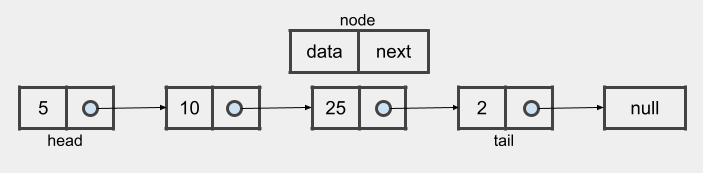
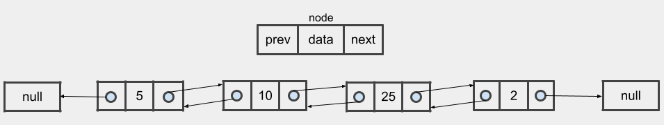

## Linked Lists

### Definition

Linked lists are linear data structures that store data in individual objects called nodes. In their most basic form, these nodes hold both the data and a reference to the next node in the list. This structure allows for efficient insertion or removal of elements from any position in the sequence during iteration. More complex variants add additional links, allowing more efficient insertion or removal of nodes at arbitrary positions. A negative of linked lists is that access time is linear (and difficult to pipeline) since, in the worst case, it will be necessary to traverse the entire list following the links until the last element. Faster access, such as the random access done for arrays, is not possible. Arrays have better cache locality compared to linked lists. Linked lists can be used to implement several other common abstract data types, including stacks and queues.

#### Singly Linked List - SLL

Singly linked lists contain nodes which have a data field as well as `next` field, which points to the next node in the list of nodes. This means that it is only possible to navigate a singly linked list in one direction, from first node (`head`) to last node (`tail`). The last node's reference holds a null pointer, which indicates the end of the list. To better understand, please see the image below.

#### Doubly Linked List - DLL

Doubly linked lists contain, besides the reference to the next node, a second reference field pointing to the previous node in the sequence. Thus, doubly linked lists can be traversed in both directions.

Code for both types of Linked Lists discussed (SLL and DLL) as well as other variations like Circular Singly Linked List and Circular Doubly Linked List can be found above in the content list of the folder.

#### Basic operations

- Traversal: O(n)
- Search: O(n)
- Append (insert at the end of the list):
  - O(1) if the last element is known, i.e., if a variable holds the tail node
  - O(n) if the last element is unknown and searching the list is needed
- Prepend (insert at the start of the list): O(1)
- Insert at any position: search time + O(1)
- Delete:
  - head node: O(1)
  - last node: O(1) if the last element is known, O(n) otherwise.
  - middle node: search time + O(1)
- Get size: O(n)

#### Advantages

- Linked list are dynamic in size, which means that its size can increase or decrease as necessary.

- Elements can be easily inserted or removed without having to reallocate or reorganize the entire structure since the data items don't need to be stored contiguously in memory, while restructuring an array at run-time is a much more expensive operation.

- Insertion/removal of nodes at any point in the list can be a constant time operation, `O(1)`, assuming that there is a pointer to the node before the one to be removed, or before the insertion point; otherwise, without this reference it is a linear time operation, `O(n)`. On the other hand, insertion/deletion in a dynamic array at random locations either requires moving the elements or resizing the array, which can be O(n) in the worst case that the position being modified is the first one.

#### Disadvantages

- As linked lists do not allow random access to the data, basic operations such as obtaining the last node of the list, finding a node that contains a given data, or locating the insertion point for a new node may require iterating through most or all of the list elements.
- Due to the need to store the pointers to other nodes, linked lists use more memory than arrays.
- Nodes are stored noncontiguously which greatly increases the time periods required to access individual elements within the list, especially with a CPU cache since we lose the benefits of cache locality.

### Time Complexity

| Access | Search | Insertion | Deletion |
| :----: | :----: | :-------: | :------: |
|  O(n)  |  O(n)  |   O(1)    |   O(1)   |

### Space Complexity

| O(n) |
| :--: |

### References

- [Wikipedia](https://en.wikipedia.org/wiki/Linked_list)
- [Tutorials Point](https://www.tutorialspoint.com/data_structures_algorithms/linked_list_algorithms.htm)

### [Index](../../README.md)
