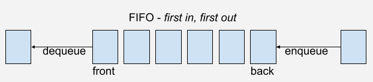

## Queues

### Definition

Collection of elements that are maintained in a sequence and can be modified by the addition of entities at one end (back/tail) of the sequence and the removal of entities from the other end of the sequence (front/head).

Queues are first-in-first-out (FIFO) data structures. Therefore, the first element added to the queue will be the first one to be removed. In queues, the focus is on the head, where elements are removed, and the tail, where they are added.

A queue can be thought of as a supermarket line: the person at the front checks out their products first, and as more people come to pay, they are added to the end of the line. Thus, the first person to enter the queue is the first to be served, and the most recent person to enter the queue is served after everyone else (FIFO).

### Basic Operations

- Enqueue: adds an element to the back of the queue.
- Dequeue: removes an element from the front of the queue.
- Peek: returns the value of the first element (head) of the queue.
- Size: returns the size of the queue.

### Arrays _vs_ Linked Lists

When building queues, it is usually better to use linked lists instead of arrays. The reason being that, when using arrays, everytime we dequeue an element, we need to shift all elements towards the front of the queue, since the first element now is the one that was previouly the second and so on. If we consider an array of `n` elements, everytime we need to dequeue an element, every single element must be shifted by one position, which is going to have an O(N) time complexity. By using a linked list, this is a matter of just setting the `first` node to be equal to the `first.next` reference, which will have a constant time complexity O(1).

Adjustments can be made in case we still want to use an array as building block. In order to avoid shifting the elements in the array and increasing the time complexity of the code, a solution would be to use the concept of a circular queue where we check if there are slots available in the array and, if so, add the new elements in these positions while keeping track of the start and the end of the queue. However, arrays are usually limited in size, so even if dynamic arrays are being used, once the queue gets full, it will be necessary to copy all elements to a different location in memory, which can add to the complexity even if the cost is amortized.

### Time Complexity

| Access | Search | Insertion | Deletion |
| :----: | :----: | :-------: | :------: |
|  O(n)  |  O(n)  |   O(1)    |   O(1)   |

### Space Complexity

| O(n) |
| :--: |

### References

- [Wikipedia](<https://en.wikipedia.org/wiki/Queue_(abstract_data_type)>)
- [Brilliant](https://brilliant.org/wiki/queues-basic/)

### [Index](../../README.md)
