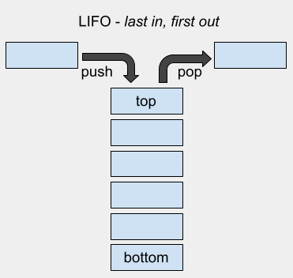

## Stacks

See code for this data structure [here](/DataStructures/Stack/src).

### Definition

A stack is an abstract data type (ADT)\* that serves as a collection of elements with restriction on where it is possible to add and remove elements. We can think of a stack as a stack of plates; if you want to remove a plate, you can remove only the top plate (the last plate inserted), and you can only add a new plate on the top. A stack can be implemented using both linked lists or arrays, with a few tradeoffs between them.

The main characteristic of a stack is that the addition or removal of items takes place at the same end, the top position. Since the last element inserted to the stack must also be the first element to be removed, we can safely conclude that the principle guiding the order in which the elements are processed in the stack is the LIFO (last-in first-out) principle.

In case a stack is implemented to have a maximum capacity and the allocated space is completely used, no more elements can be pushed and attempting to do so will result in an stack overflow error. The opposite can also happen, when a pop is attempted when the stack is empty, this results in a stack underflow error.

\*Abstract data type - ADT: a way of classifying data structures based on how they are used and the behaviors they provide (i.e. from the user's point of view) without specifying how the data structure must be implemented or laid out in memory (implementer's point of view), but simply provide a minimal expected interface and set of behaviors.

### Basic Operations

- Push: adds an element to the top of the stack.
- Pop: removes an element from the top of the stack.
- Peek: returns the value of the element at the top of the stack.
- Size: returns the size of the stack, i.e, the number of elements.

### Arrays _vs_ Linked Lists

Arrays are usually created with fixed size (_static arrays_), so it may not be possible to increase its size which can limit the stack capabilities, and even when it is possible to increase its size (_dynamic arrays_), it usually means allocating double the original array capacity in another memory location and copying all the elements to this new location, which may not be very efficient. Additionally, arrays can take advantage of cache locality, which means that as arrays are stored contiguously in memory, large chunks of them will be loaded into the cache upon first access. This makes it quick to access future elements of the array.

Linked lists, on the other hand, are neither created with fixed size nor stored in contiguous memory spaces, so its size can be increased without problems. However, it is worth mentioning that LLs use an extra variable which stores the reference to the next node, which increases memory consumption. Also, as linked lists aren't necessarily stored in contiguous blocks of memory, this could lead to more cache misses when trying to access further elements, increasing the time it takes to access them.

_Example_: If we wanted to loop through an array, the first access would require us to go to memory to retrieve it (a slow operation in CPU cycles). However, after the first access, the rest (or at least a good portion) of the array would be stored in the cache, and subsequent accesses would be much quicker. With linked lists, the first access would require us to go to memory as well, but as the processor will cache memory directly surrounding the location of the element being accessed, it won't necessarily capture any of the other elements in the list, meaning that when trying to access the next element in the list, we will probably have to go to memory again.

### Time Complexity

| Access\* | Search | Insertion | Deletion | Peek |
| :------: | :----: | :-------: | :------: | :--: |
|   O(n)   |  O(n)  |   O(1)    |   O(1)   | O(1) |

\*In case you want to access the bottom stack item.

### Space Complexity

| O(n) |
| :--: |

### References

- [Wikipedia](<https://en.wikipedia.org/wiki/Queue_(abstract_data_type)>)
- [Brilliant](<https://en.wikipedia.org/wiki/Stack_(abstract_data_type)>)

### [Index](../../README.md)
